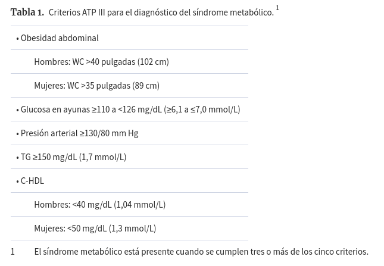
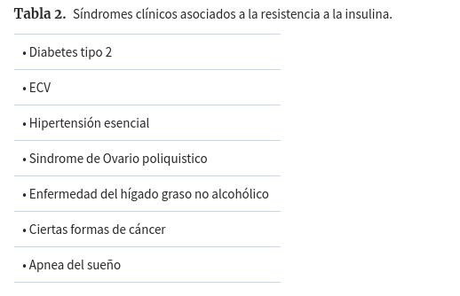

[The Metabolic Syndrome: Requiescat in Pace](https://academic.oup.com/clinchem/article/51/6/931/5629897)

#  The Metabolic Syndrome: Requiescat in Pace 

[Gerald M Reaven](javascript:;) 

_Clinical Chemistry_, Volume 51, Issue 6, 1 June 2005, Pages 931–938, <https://doi.org/10.1373/clinchem.2005.048611>

Published:

01 June 2005

### Cite  
Gerald M Reaven, The Metabolic Syndrome: Requiescat in Pace, _Clinical Chemistry_, Volume 51, Issue 6, 1 June 2005, Pages 931–938, <https://doi.org/10.1373/clinchem.2005.048611>  
## Abstracto

Los valores para la eliminación de la glucosa mediada por insulina varían continuamente en una población de individuos aparentemente sanos, con al menos una variación de seis veces entre la más sensible a la insulina y la mayoría resistente a la insulina de estos individuos. Cuanto más resistente a la insulina sea una persona, más insulina debe ser secretada para prevenir la descompensación de la tolerancia a la glucosa. La resistencia a la insulina no es una enfermedad, sino una descripción de un estado fisiológico, y aproximadamente un tercio de una población aparentemente saludable es lo suficientemente resistente a la insulina que debe tener un mayor riesgo para desarrollar un grupo de anomalías y síndromes clínicos relacionados. El valor primario del concepto de resistencia a la insulina es que proporciona un marco conceptual con el que colocar un número sustancial de eventos biológicos aparentemente no relacionados en un constructo fisiopatológico. En contraste, el síndrome metabólico se introdujo como una categoría de diagnóstico para identificar a las personas que satisfacen tres de cinco criterios elegidos relativamente arbitrariamente para iniciar cambios en el estilo de vida con el objetivo de disminuir el riesgo de enfermedad cardiovascular. En consecuencia, el valor de la noción del síndrome metabólico debe considerarse en términos fisiopatológicos, sino como un enfoque pragmático para obtener un mejor resultado clínico. En esta revisión, se hace un esfuerzo para evaluar críticamente el concepto del síndrome metabólico, los criterios elegidos para identificar a los individuos con el síndrome y la utilidad clínica de hacer, o no hacer, un diagnóstico del síndrome metabólico.

En 2001, el Panel de tratamiento de adultos III (ATP III) [1] (JavaScript:;) del Programa Nacional de Educación del Colesterol propuso los criterios para diagnosticar lo que designaron el síndrome metabólico ([1] . Desde el informe original de Ford et al. ([2]  En 2002 describiendo la prevalencia del síndrome metabólico en los Estados Unidos, se han publicado múltiples trabajos que abordan el mismo problema. Como ejemplo de este fenómeno, cito 14 artículos ([3]  ([4]  ([5]  ([6] (JavaScript:;) ) ([7]  ([8]  ([9]  ([10]  ([11] (JavaScript:;) ) ([12]  ([13]  ([14]  ([15]  ([16] (JavaScript:;) ) que representan una pequeña muestra de las publicadas sobre este tema en 2004; Se basaron principalmente en análisis retrospectivos de estudios basados ​​en la población, realizados en varios países, con datos experimentales reunidos por una variedad de razones diferentes, en grupos diferentes en términos de edad, sexo y etnia. Aunque esta explosión de actividad creativa ha llevado a una enorme cantidad de datos publicados, no está claro que ha llevado a la entrega de ninguna nueva información de una utilidad significativa al médico practicante. De hecho, como se discutirá posteriormente, si se toma a su valor nominal, existe una posibilidad real de que el uso de los criterios ATP III pueda hacer más daño que bien. Al menos, podría ser útil tomar un aspecto algo escéptico a las implicaciones clínicas de implementar los criterios de diagnóstico propuestos por la ATP III, y el esfuerzo por abordar este problema es la justificación de esta presentación.

## definición del síndrome metabólico

El establecimiento de criterios para diagnosticar lo que el informe ATP III denominó el síndrome metabólico ([1]  representó un esfuerzo para reconocer la importancia de la resistencia a la acción de insulina, y sus consecuencias, como aumentar el riesgo de enfermedad cardiovascular ( CVD). El ATP III ([1]  reconoció la importancia como los factores de riesgo de CVD de lo que llamaron una "constelación de los factores de riesgo lípidos y no lípidos de origen metabólico", designó este grupo como el síndrome metabólico, y declaró que "este síndrome está estrechamente relacionado con la resistencia a la insulina". La Tabla 1 [1] (# T1) enumera los cinco criterios seleccionados por el ATP para identificar a las personas con el síndrome metabólico \ [obesidad abdominal, la glucosa de alterado deteriorada, el alto triglicérido (TG) y las concentraciones bajas de colesterol HDL-colesterol (HDL-C), y una mayor presión arterial \], y refleja su opinión de que la resistencia a la insulina está en la raíz del problema. Los objetivos principales del ATP III en el establecimiento de criterios para hacer que el diagnóstico del síndrome metabólico debía identificar a las personas a un aumento del riesgo de ECV y usar esta información para iniciar cambios en el estilo de vida para disminuir este riesgo.

Los criterios individuales enumerados en la Tabla 1 [1] (# T1) parecen haber sido seleccionados porque tienden a agruparse, así como a ocurrir más comúnmente en individuos resistentes a la insulina ([17]  ([18 ] . Además, todos se han asociado con un mayor riesgo de CVD ([19]  ([20]  ([21]  ([22] (JavaScript:; )) ([23] . Sin embargo, antes de centrarse en los componentes individuales que conforman los criterios de diagnóstico para el síndrome metabólico, algunos comentarios generales sobre las deliberaciones que llevaron a su creación son dignas de la nota. Quizás el problema más crucial es que los criterios de diagnóstico para el síndrome metabólico no resultaron de un estudio prospectivo y no representan el resultado de un proceso basado en la evidencia, sino que son un reflejo de las mejores estimaciones de un panel de "expertos". Además, no solo los puntos de corte no solo son los cinco criterios elegidos arbitrarios, no hay razón para creer que los elementos individuales del síndrome metabólico son igualmente reflexivos de los presumidos defectos básicos o el riesgo de ECV. De hecho, no está claro lo que llevó a la decisión de seleccionar cinco criterios (¿por qué no cuatro o seis?), Ni por qué satisfacer a tres de los cinco criterios arbitrarios tiene más utilidad clínica que cualquier otra persona. A la luz de las consideraciones anteriores, existe una amplia razón para cuestionar la utilidad clínica de hacer un diagnóstico positivo (o negativo) del síndrome metabólico.

Además, antes de examinar críticamente los criterios propuestos para realizar el diagnóstico del síndrome metabólico, es esencial enfatizar que el informe de la ATP III se centró completamente en el papel de la resistencia a la insulina como un riesgo creciente de CVD.Ahora está claro, sin embargo, que una variedad de anomalías y síndromes clínicos es más probable que ocurran en individuos resistentes a la insulina.Específicamente, además de la CVD, los individuos resistentes a la insulina tienen un mayor riesgo de desarrollar diabetes tipo 2, hipertensión esencial, enfermedad hepática no alcohólica, enfermedad de ovario poliquístico, ciertas formas de cáncer y apnea del sueño (Tabla 2 [2] (# T2)).Estos problemas no se pueden discutir en detalle en el contexto de esta presentación, pero dicha información está disponible en dos artículos recientes de revisión ([24]  ([25] .

## examinando los componentes individuales del síndrome metabólico

### circunferencia de la cintura

La inclusión de una medida del exceso de adiposidad \ [Circunferencia de la cintura (WC) \] Como uno de los criterios de ATP III para diagnosticar el síndrome metabólico parece incongruente, ya que, en contraste con otros criterios, no es una consecuencia de la resistencia a la insulina. En cambio, la obesidad es una variable de estilo de vida que, junto con la inactividad física, tiene un efecto adverso en la eliminación de glucosa mediada por insulina ([26]  ([27]  ([28] (JavaScript :))), por lo tanto, aumentando las posibilidades de que se desarrollen las anomalías y los síndromes clínicos asociados con la resistencia a la insulina. Dicho más específicamente, la resistencia a la insulina / hiperinsulinemia no causa obesidad; La obesidad es una variable fisiológica que aumenta la probabilidad de que un individuo sea resistente a la insulina. Para entender el síndrome metabólico en términos fisiopatológicos, es necesario que se vea la obesidad que contribuya a la resistencia / hiperinsulinemia de la insulina, en contraste con los otros cuatro criterios, que representan cambios que tienen más probabilidades de ocurrir en individuos resistentes a la insulina / hiperminémica.

El hecho de que la obesidad no sea una consecuencia de la resistencia a la insulina / la hiperinsulinemia no debe ocultar el hecho de que cuanto más sobrepeso / obesidad sea un individuo, más probable es que el individuo sea lo suficientemente resistente a la insulina para ser un mayor riesgo para desarrollar uno o más de las consecuencias clínicas adversas asociadas con el defecto en la acción de insulina. Esto es claramente de gran importancia clínica a la luz de la actual epidemia mundial de la obesidad. Por otro lado, aunque el sobrepeso / obeso aumenta las posibilidades de que una persona que sea significativamente resistente a la insulina, de ninguna manera, todos los individuos con sobrepeso / obesos son resistentes a la insulina, y, de mayor relevancia clínica, pérdida de peso en personas con sobrepeso / obesas que no están La resistencia a la insulina no conduce a un beneficio clínico sustancial ([26]  ([27]  ([28]  ([29]  ( [30] . Por lo tanto, tener sobrepeso / obeso es un hallazgo que debe alertar al proveedor de atención médica a la posibilidad de que un individuo sea resistente a la insulina y, con mayor riesgo de desarrollar los síndromes clínicos enumerados en la Tabla 2 [2] (# T2). Como tal, la pregunta se convierte en una de las formas más efectivas de identificar a estos individuos.

El ATP III ha enfatizado la importancia del WC como la estimación de la adipositación en la premisa de que es un índice más estrechamente relacionado con la resistencia a la insulina y sus consecuencias que la obesidad generalizada según lo determinado por el índice de masa corporal (IMC). Sin embargo, su superioridad como herramienta clínica puede ser interrogada. En el nivel más sencillo, los valores de las dos variables se correlacionaron altamente en un análisis reciente ([31]  de datos de ~20 000 participantes en la encuesta nacional de salud y nutrición (NHANES) desde 1988-1994 y 1999-2000 \. Más específicamente, los valores _R_ fueron> 0.9 en cada subgrupo analizado y fueron esencialmente idénticos, independientemente de las diferencias en el sexo, la edad o la etnicidad.

La altura y el peso se miden de forma rutinaria en la mayoría de las instalaciones de atención médica de una manera razonablemente simple, y el IMC se calcula fácilmente al referirse a las tablas simples. En contraste, el siguiente párrafo contiene las instrucciones para medir WC de acuerdo con el Protocolo de NHANES:

> Los stands de sujeto y el examinador, posicionados a la derecha del sujeto, palpates el hueso de la cadera para localizar la cresta ilíaca. Justo por encima del borde lateral superior de la cresta ilíaca derecha, se dibuja una marca horizontal, y luego se cruza con una marca vertical en la línea midaxilar. La cinta métrica se coloca en un plano horizontal alrededor del abdomen a nivel de este punto marcado en el lado derecho del tronco. El plano de la cinta es paralelo al suelo y la cinta está cómoda, pero no comprime la piel. La medición se realiza a la inspiración mínima normal.

A lo mejor de mi conocimiento, los datos en cuanto a la reproducibilidad de las mediciones de WC en cualquier sitio clínico dado, y mucho menos desde el sitio hasta el sitio, al seguir este protocolo preciso, no están disponibles. También parece razonable expresar escepticismo con respecto a la probabilidad de que las mediciones de WC se realicen con este mismo grado de seriedad, y de manera uniforme, en los centros de salud en todo Estados Unidos.

Además, como se señaló en un informe reciente ([32] , parece que los estudios que demuestran la relación entre la obesidad abdominal y las consecuencias clínicas adversas se han basado en al menos 14 métodos diferentes para cuantificar WC, e incluso el 4 Los enfoques más utilizados en los últimos usos produjeron valores absolutos bastante diferentes para WC. Este problema se confunde aún más por un informe reciente de la OMS que expresa la preocupación de que, debido a que los efectos adversos de la obesidad variarán en función de la etnicidad, será necesario desarrollar valores específicos de origen étnico para identificar a los individuos con sobrepeso / obesos a mayor riesgo ([ 33] .

Dada la información discutida anteriormente, parece contraproducente pensar que será posible desarrollar puntos de corte específicos para WC, que varía según el origen étnico, que se midará con precisión para satisfacer uno de los criterios de diagnóstico de la versión ATP III del síndrome de ATP III. Cuando estos problemas pragmáticos se acoplan con el hecho de que el sobrepeso / obeso simplemente aumenta la probabilidad de que un individuo sea resistente a la insulina, parece más sensible medir simplemente la altura y el peso, evaluar a IMC y saber que tener un BMI> 25.0 kg / M2 aumenta las posibilidades de que un individuo sea resistente a la insulina de la misma manera que, por ejemplo, tener un historial familiar de diabetes tipo 2, hipertensión esencial o CVD; ser de ascendencia no europea; o tener acantosis nigricans. Debe alertar a uno para buscar las manifestaciones de la resistencia a la insulina, no más, ni menos.

En resumen, el sobrepeso / obeso aumenta la probabilidad de que un individuo sea lo suficientemente resistente a la insulina para desarrollar uno de los resultados clínicos adversos enumerados en la Tabla 2 [2] (# T2).Por lo tanto, la obesidad es similar a varios otros hallazgos del historial médico y el examen físico que hacen que sea más probable que un individuo sea resistente a la insulina.Si se desea un método para cuantificar el grado de obesidad, parece que el IMC y el WC están bien correlacionados, y la medición del IMC es una forma más sencilla y más efectiva de lograr esa tarea.

### Concentración de glucosa plasma en ayunas

La American Diabetes Association (ADA) ha introducido la categoría de deterioro de glucosa en ayunas (IFG) para clasificar a las personas que tienen "prediabetes", y inicialmente ([34]  sugirieron que las personas con una concentración de glucosa plasmática en ayunas entre 110 y 125 mg / dl (6.1-6.9 mmol / l) mereció esa designación. Debido a que una glucosa en ayunas ≥126 mg / dl (7,0 mmol / l) es diagnóstico de la diabetes, una enfermedad conocida inequívocamente para aumentar el riesgo de ECV, parece probable que la selección de IFG por el ATP III ayude en el diagnóstico del síndrome metabólico Se derivó de la creación de este nuevo criterio de diagnóstico por la ADA. Aunque existe una evidencia epidemiológica sustancial de que cuanto mayor sea la concentración de glucosa en plasma, más probable es que un individuo sea desarrollar diabetes tipo 2, no es tan claro que el uso de la IFG proporciona una forma particularmente efectiva de identificar la presencia de resistencia a la insulina o para predecir el riesgo de CVD. Los valores de la eliminación de glucosa mediada por insulina se distribuyen continuamente en toda la población no diabética ([35] , y los resultados de dos estudios prospectivos sugieren que el tercio de la población que es la mayoría de la insulina resistente es un riesgo significativamente mayor. Para desarrollar uno o más de los síndromes clínicos enumerados en la Tabla 2 [2] (# T2) ([36]  ([37] . Cuando esta definición de resistencia a la insulina clínica significativa se aplicó a una población de 490 individuos aparentemente sanos, solo 27 (5,5%) tenían IFG, y 17 de estos 27 (63%) estaban en el tercil ([38] (JavaScript) resistente a la insulina ([38] (JavaScript :;)), dando una prueba con gran especificidad (327 de 337, o ~97%), pero baja sensibilidad (17 de 163, o ~10%). La sensibilidad de identificar a los individuos resistentes a la insulina se puede aumentar esencialmente tres veces al medir la concentración de glucosa en plasma después de una carga de glucosa oral y usar el criterio de diagnóstico de ADA para la tolerancia de glucosa deteriorada \ [IGT = concentración de glucosa plasmática de 140-199 mg / dl (7.8- 11.0 mmol / L) 120 min después de un desafío oral de 75 g \] ([38] . Además, el 25% de los que en el tercil más resistente a la insulina no tenían prediabetos, tal como se definen, ya sea por IFG o IGT ([38] .

Es evidente de estos hallazgos que la presencia de IFG, tal como lo propone inicialmente por la ADA, y adoptada por la ATP III, ocurre con demasiada poca frecuencia para ser muy útil en el diagnóstico de la resistencia a la insulina o en el síndrome metabólico. De hecho, si el objetivo es identificar a las personas con un mayor riesgo de ECV, los resultados del estudio de decodificación sugieren encarecidamente que sería más útil buscar IGT en lugar de IFG ([39] . Más recientemente, la ADA ha modificado su definición de IFG y ahora sugiere que este diagnóstico se aplica a las personas cuya concentración de glucosa en plasma en ayunas es de 100-125 mg / dL (5.6-6.9 mmol / L) ([40] (JavaScript:;) ), y la ATP III ha seguido su demanda modificando su criterio de glucosa en plasma en ayunas en consecuencia ([41] . Una razón para que la ADA disminuya la concentración de glucosa en plasma en ayunas para el diagnóstico de IFG fue capturar más personas con IGT, y Tai et al. ([42]  ha confirmado que este fue el caso en el estudio de cohorte CVD de Singapur. Estos autores señalaron que, aunque la prevalencia de IFG aumentó (de 9.5% a 32.3%) con los criterios revisados, asociados con un aumento en el número identificado en riesgo para desarrollar diabetes tipo 2 y ECV, identificando la IGT fue una forma más efectiva de lograr ese objetivo. En contraste, Borch-Johnsen et al. ([43] , el uso de datos de varios países, advirtió que solo una minoría relativa de los identificados con la modificación de ADA propuesta de IFG tendría IGT y que el perfil de riesgo de CVD sea significativamente más bajo que en aquellos individuos Cumpliendo con el criterio de diagnóstico original. Finalmente, los autores de ambas publicaciones ([42]  ([43]  expresaron una gran preocupación de que la adopción de la recién propuesta de definición ADA de IFG tendría consecuencias adversas para la salud pública, con Borch- Johnsen et al. ([43]  Advertencia de que el uso de la nueva definición propuesta de IFG crearía "una pandemia de prediabetes". Obviamente, las mismas preocupaciones se aplican a la incorporación del criterio ADA revisado de IFG en las Directrices para diagnosticar el síndrome metabólico.

En el sentido más general, mayor será la concentración de glucosa en plasma en ayunas, más probable es que un individuo sea resistente a la insulina y, con un mayor riesgo de desarrollar los síndromes clínicos enumerados en la Tabla 2 [2] (# T2). Determinar la concentración de glucosa en plasma en ayunas es claramente importante para identificar a los pacientes con diabetes tipo 2 y, posteriormente, lo que lleva al inicio del control glucémico apropiado. Por otro lado, el conocimiento de la concentración de glucosa en plasma en ayunas no proporciona una estimación sustituida particularmente útil de la resistencia a la insulina, que representa solo ~5% -15% de la varianza (dependiendo del grado de adiposidad) en la eliminación de glucosa mediada por insulina en la población en general ([44] . Si se debe usar la concentración de glucosa en plasma para identificar a los individuos resistentes a la insulina con un mayor riesgo para desarrollar CVD, parece que las mediciones realizadas después de un desafío de glucosa oral ofrecen la utilidad más clínica ([38] (JavaScript:)) ([39 ]  ([42]  ([43] . En ausencia de obtener esta información, ni punto de corte para identificar a los pacientes con el síndrome metabólico propuesto por el ATP III parece ser particularmente útil.

### DISLIPIDEMIC componentes

Los componentes dislipidemicos del síndrome metabólico, una TG alta y una concentración baja en HDL-C, son los criterios ATP III vinculados más estrechamente con la resistencia a la insulina y al riesgo de CVD. Por ejemplo, las diferencias en la concentración de TG de plasma pueden representar el ~36% de la variación en la eliminación de glucosa mediada por insulina en la misma población en la que la concentración de glucosa en plasma en ayunas represente solo el 5% -15% de la variabilidad. De hecho, la relación entre la concentración de TG de plasma y la eliminación de glucosa mediada por insulina es comparable a la de la concentración de la insulina plasmática en ayunas y la acción de insulina, una estimación sustituta comúnmente utilizada de la resistencia a la insulina ([35] .

La capacidad de un HDL-C bajo para predecir el riesgo de CVD se conoce durante muchos años ([45] , y aunque se han planteado temas relacionados con el papel de un aumento de la concentración de TG como un CVD "independiente" Factor de riesgo ([46] , sin duda hay evidencia en apoyo de esa noción ([21]  ([47] . Además, aunque no se cita como uno de los criterios para diagnosticar el síndrome metabólico, el perfil de lipoproteína aterogénica asociado con la resistencia a la insulina también incluye una disminución en el diámetro de partículas LDL (pequeño, denso LDL) y la acumulación postprandial de lipoproteínas remanentes ricas en TG ([ 48]  ([49] , y también se ha demostrado que estos cambios se asocian con un aumento del riesgo CVD ([50]  ([51] (JavaScript: ;)). Además, la evidencia del estudio del corazón de Helsinki y el estudio VA-HIT demostraron que el uso de gemfibrozilo, un agente que disminuye el plasma TG y aumenta las concentraciones HDL-C, disminuyendo significativamente el riesgo de CVD ([52] (Javascript:)) ( [53] . De particular interés en este contexto es el análisis reciente de los datos de VA golpeado que indican que las personas que tenían las concentraciones de insulina plasmáticas más altas al inicio del estudio, y presumiblemente fueron las más resistentes a la insulina, beneficiadas al máximo el tratamiento de gemfibrozil ([54] (JavaScript: ;)).

Aunque es posible cuestionar los puntos de corte absolutos propuestos por el ATP III para evaluar la importancia clínica de las mediciones de TG de plasma y HDL-C, obviamente hay información abundante que sugiere que los criterios dislipidemicos propuestos por la ATP III son característicos de la insulina resistentes a la insulina. / Los individuos hiperinsulinémicos, son altamente predictivos de riesgo de ECV, y cuando se tratan las condiciones, conducen a una disminución de la incidencia de ECV. Como tal, son bastante diferentes de los criterios de concentración de glucosa plasma en ayunas. Más importante aún, plantean una pregunta fundamental en cuanto a la utilidad clínica del síndrome metabólico que todos los proveedores de atención médica deben enfrentar: se debe iniciar el tratamiento adecuado en un paciente con una TG de plasma alta y una concentración de HDL-C baja, incluso si no lo hacen ¿Tiene prediabetos o obesidad abdominal? La respuesta a esta pregunta comienza a enfocar la discusión sobre las implicaciones de hacer, o no hacer, un diagnóstico del síndrome metabólico según lo definido por el ATP III.

### presión sanguínea

La relación más complicada entre la resistencia a la insulina / hiperinsulinemia, la versión ATP III del síndrome metabólico y el CVD se relaciona con el papel de la hipertensión esencial. El problema se deriva del hecho de que no más del 50% de los pacientes con hipertensión esencial son resistentes a la insulina ([55] , pero que es este subconjunto de pacientes que están en mayor riesgo de CVD ([56] ( JavaScript:;)) ([57]  ([58] . Por ejemplo, los pacientes con hipertensión esencial con la evidencia de electrocardiógrafos de cambios isquémicos son intolerantes y hiperinsulinémicos algo de glucosa en comparación con un grupo de control normotensivo o pacientes con hipertensión esencial cuyos electrocardiogramas son totalmente normales ([56] . No es sorprendente que la medición de la eliminación de glucosa mediada por insulina demostró que los pacientes con hipertensión esencial y cambios de electrocardiógrafos isquémicos fueron resistentes a la insulina y que los cambios dislipídicos asociados con la resistencia / hiperinsulinemia de la insulina estuvieran presentes en estas personas en comparación con las personas normotensas o pacientes hipertensos con electrocardiogramas normales.

El vínculo entre la dislipidemia presente en pacientes resistentes a la insulina / hiperinsulinémica con hipertensión esencial y CVD es consistente con los resultados de dos informes del estudio masculino de Copenhague. En la primera publicación, Jeppesen et al. ([57]  mostró que el desarrollo de ECV en individuos con un TG alto y una concentración de HDL-C baja fue independiente de las diferencias en la presión arterial sistólica o diastólica. En contraste, la presión arterial más alta, ya sea sistólica (_P_ <0.001) o diastólica (_P_ <0.001) o Diastolic (_P_ <0.03), la mayor incidencia de ECV en aquellos sin los cambios dislipídicos asociados con la resistencia a la insulina.

En un segundo estudio ([58] , 2906 participantes en el estudio masculino de Copenhague se dividieron en tres grupos sobre la base de sus concentraciones de TG de plasma y HDL-C en ayunas. Pacientes con hipertensión cuya concentración de plasma TG estuvo en el tercio superior de la población, asociada con una concentración de HDL-C plasma en el tercio inferior, se encontraba en mayor riesgo de ECV, mientras que el riesgo de CVD no se incrementó en aquellos pacientes que no tenían la dislipidemia. Característica de la resistencia a la insulina / hiperinsulinemia.

La evidencia resumida anteriormente proporciona un apoyo sustancial para la opinión de que el riesgo CVD asociado con los aumentos en la presión arterial aumenta significativamente cuando la anomalía hemodinámica está presente en individuos resistentes a la insulina. En consecuencia, puede ser más importante que un punto de vista clínico se centre en si un aumento de la presión arterial se asocia con las manifestaciones dislipídicas de la resistencia a la insulina, en lugar de interrogar si el paciente en cuestión cumple con los criterios de diagnóstico para el síndrome metabólico.

## Resumen

Los valores para la eliminación de glucosa mediada por insulina varían continuamente en una población de individuos aparentemente sanos, con al menos una variación de seis veces entre la más sensible a la insulina y la mayoría resistente a la insulina de estos individuos ([35] . Por lo tanto, no hay una forma objetiva de clasificar a un individuo como resistente a la insulina. Hemos intentado en dos estudios prospectivos para desarrollar una definición operativa de resistencia a la insulina, y los resultados de estos esfuerzos nos han llevado a sugerir que aproximadamente un tercio de una población aparentemente saludable es lo suficientemente resistente a la insulina para desarrollar una enfermedad clínica significativa ([36] ( JavaScript:;)) ([37] . Es esencial enfatizar en este punto que la resistencia a la insulina no es una enfermedad, sino una descripción de un estado fisiológico que aumenta en gran medida las posibilidades de que un individuo desarrolle varias anomalías estrechas y síndromes clínicos asociados. La resistencia a la insulina no conduce necesariamente a los síndromes clínicos enumerados en la Tabla 2 [2] (# T2), y a varios grados, los síndromes pueden ocurrir en ausencia de resistencia a la insulina. El valor primario del concepto de resistencia a la insulina es que proporciona un marco conceptual con el que colocar un número sustancial de eventos biológicos aparentemente no relacionados en una construcción fisiopatológica. Su objetivo principal es no hacer un diagnóstico, sino a aumentar la comprensión de por qué, por ejemplo, una mujer con síndrome de ovario poliquístico es más probable que desarrolle diabetes tipo 2 que una mujer con una historia menstrual normal ([59] (Javascript:;) ). Esto no implica que la noción de resistencia a la insulina sea sin utilidad clínica. Por ejemplo, explica por qué las mujeres con síndrome de ovario poliquístico deben controlarse de cerca para la evidencia de deterioro de la tolerancia a la glucosa ([60] , y el vínculo aparente entre la resistencia a la insulina / hiperinsulinemia compensatoria y el curso clínico de cáncer de mama ([61]  proporciona un objetivo mecanicista obvio con el que experimentar con nuevas opciones de tratamiento.

En contraste, el síndrome metabólico se centra en solo uno de los síndromes clínicos asociados con la resistencia a la insulina enumerados en la Tabla 2 [2] (# T2), y la razón para su implementación es hacer un diagnóstico para iniciar cambios en el estilo de vida con el objetivo de disminuyendo el riesgo de CVD. En consecuencia, su valor debe considerarse no en términos fisiopatológicos, sino como un enfoque pragmático para obtener un mejor resultado clínico. Por lo tanto, el hecho de que la obesidad sea una variable que contribuye a la resistencia a la insulina, no una consecuencia del defecto en la acción de insulina, no necesariamente no restura de la utilidad del síndrome metabólico. Sin embargo, las posibilidades de que la medida de la obesidad enumerada en la Tabla 1 [1] (# T1) puede ser menor que la ideal y que los valores de WC pueden ser las más aplicables a las personas de la ascendencia europea, son temas que necesitan más discusión. De manera similar, ¿cuál es el valor de la IFG como un criterio de diagnóstico cuando solo el 5% de una población aparentemente saludable tiene esa anomalía?

A pesar de las limitaciones potenciales de los criterios que se han propuesto para diagnosticar el síndrome metabólico, la pregunta más fundamental se refiere a la utilidad clínica de usarlas para decidir si un individuo, o no, merece ese sobrenombre. En ese contexto, imagina a dos hombres, ambos de los cuales tienen presiones sanguíneas y concentraciones de plasma TG lo suficientemente altas como para satisfacer los criterios ATP III para merecer el diagnóstico del síndrome metabólico, pero tampoco tuvo una cintura suficientemente grande o una glucosa en plasma en ayunas al máximo para calificar para ese diagnóstico. De hecho, la única diferencia aparente entre ellos era que la concentración HDL-C era de 38 mg / dL (1,0 mmol / L) en una de ellas, mientras que el otro tenía un valor de 42 mg / dl (1.1 mmol / l) . Por definición, un hombre tiene el síndrome metabólico; El otro no lo hace. ¿Son estos individuos fundamentalmente diferentes? ¿Las opciones de tratamiento diferirían de alguna manera sustantiva? ¿Sabe que un paciente tiene una presión arterial aumenta, así como una alta concentración de TG de plasma, no merece la intervención clínica adecuada? ¿Importa que el paciente no tenga el síndrome metabólico, ya que su WC, la concentración de glucosa en plasma en ayunas y la concentración de HDL-C no cumplen con los criterios arbitrarios establecidos por el ATP III?

Tal vez el punto se hace aún más enfáticamente si se atiende la atención a los pacientes cuyas concentraciones de glucosa plasmática en ayunas merecen el diagnóstico de la diabetes tipo 2. Estas personas claramente tienen una enfermedad, y cada año, ADA publica las directrices de tratamiento para que estos pacientes disminuyan su riesgo de desarrollar las complicaciones microangiopáticas y macrovasculares de la diabetes tipo 2. ¿Hay alguna utilidad clínica para determinar si estos pacientes tienen el síndrome metabólico? Esta pregunta retórica se abordó en el estudio de Monferrato de Casale, que evaluó la capacidad de la definición de la OMS del síndrome metabólico para predecir la mortalidad por todas las causas y cardiovasculares en 1565 pacientes con diabetes tipo 2 ([62] . Los resultados de este estudio indicaban que "categorizar los sujetos diabéticos tipo 2 que tener o no tener el síndrome metabólico no proporciona una predicción adicional en comparación con el conocimiento de sus componentes individuales". Parentéticamente, en la misma edición de _diabetes care_, los criterios de ATP III para diagnosticar el síndrome metabólico se aplicaron a las poblaciones del estudio de San Antonio Heart y el estudio de la diabetes de la Ciudad de México ([63] , con el hallazgo que "el síndrome metabólico es inferior a los modelos de predicción establecidos para la diabetes tipo 2 o la CVD". Este último hallazgo es consistente con una publicación anterior ([30]  que muestra que la medición simple de las concentraciones de TG de plasma y HDL-C proporcionó información que era esencialmente tan útil como la versión ATP III del síndrome metabólico en la identificación de aquellos. Aparentemente, los individuos sanos que eran lo suficientemente resistentes a la insulina para tener un mayor riesgo para desarrollar los síndromes clínicos enumerados en la Tabla 2 [2] (# T2).

En conclusión, parece que hacer que el diagnóstico del síndrome metabólico no le traiga mucho en el camino de la comprensión fisiopatológica o la utilidad clínica, y decidir que las personas no lo tienen porque no cumplen con los cinco de los cinco criterios elegidos arbitrariamente pueden retenerIntervención terapéutica relevante.¿El concepto ATP III del síndrome metabólico tiene virtudes de redención?Esa es una pregunta que solo el lector puede responder.

1.	Executive summary of the third report of the National Cholesterol Education Program (NCEP) Expert Panel on Detection, Evaluation, And Treatment of High Blood Cholesterol in Adults (Adult Treatment Panel III). JAMA 2001;285:2486-2497.
2.	Ford ES, Giles WH, Dietz WH. Prevalence of the metabolic syndrome among US adults: findings from the Third National Health and Nutrition Examination Survey. JAMA 2002;287:356-359.
3.	Cruz ML, Weigensberg MJ, Huang TT, Ball G, Shaibi GQ, Goran MI. The metabolic syndrome in overweight Hispanic youth and the role of insulin sensitivity. J Clin Endocrinol Metab 2004;89:108-113.
4.	Cheng T. Metabolic syndrome in China. Circulation 2004;109:e180.
5.	Weiss R, Dziuna J, Birgert TS, Tamborlane WV, Taksali SF, Yeckel CW, et al. Obesity and the metabolic syndrome in children and adolescents. N Eng J Med 2004;350:2362-2374.
6.	Weiss R, Dziura J, Burgert TS, Tamborlane WV, Taksali SE, Yeckel CW, et al. Obesity and the metabolic syndrome in children and adolescents. Obstet Gynecol Surv 2004;59:822-824.
7.	Farrell S, Cheng YJ, Blair SN. Prevalence of the metabolic syndrome across cardiorespiratory fitness levels in women. Obes Res 2004;12:824-830.
8.	Kinder LS, Carnethon MR, Palaniappan LP, King AC, Fortmann SP. Depression and the metabolic syndrome in young adults: findings from the Third National Health and Nutrition Examination Survey. Psychosom Med 2004;66:316-322.
9.	Oh JY, Hong YS, Sung YA, Barrett-Connor E. Prevalence and factor analysis of metabolic syndrome in an urban Korean population. Diabetes Care 2004;27:2027-2032.
10.	Sr-Onge MP, Jamssen I, Heymsfield SB. Metabolic syndrome in normal-weight Americans; new definition of the metabolically obese, normal weight individual. Diabetes Care 2004;27:2222-2228.
11.	Ilanne-Parikka P, Erickson JG, Lindstrom J, Hamalainen H, Keinanen-Kiukaanniemi S, Laasko M, et al. Finnish Diabetes Prevention Study Group. Prevalence of the metabolic syndrome and its components: findings from Finnish general population sample and the Diabetes Prevention Study cohort. Diabetes Care 2004;27:2135-2140.
12.	Aguilar-Salinas CA, Rojas R, Gomez-Perez FJ, Valles V, Rios-Torres JM, Franco A, et al. High prevalence of metabolic syndrome in Mexico. Arch Med Res 2004;35:176-181.
13.	Ozsahim AK, Gokeek A, Sezgin N, Akbaba M, Guvener N, Ozesik L, et al. Prevalence of the metabolic syndrome in a Turkish Adult population. Diabetes Nutr Metab 2004;17:230-234.
14.	Simmons D, Thompson CF. Prevalence of the metabolic syndrome among adult New Zealanders of Polynesian and European descent. Diabetes Care 2004;27:3002-3004.
15.	Song J, Kim E, Shin C, Kim SS, Lee HK, Jung M, et al. Prevalence of the metabolic syndrome among South Korean adults: the Ansan study. Diabet Med 2004;21:1154-1155.
16.	Kim ES, Han SM, Kim YI, Song KH, Kim MS, Kim W, et al. Prevalence and clinical characteristics of metabolic syndrome in a rural population of South Korea. Diabet Med 2004;21:1141-1143.
17.	Reaven GM. Role of insulin resistance in human disease. Diabetes 1988;37:1595-1607.
18.	Reaven GM. The insulin resistance syndrome. Curr Atheroscler Rep 2003;5:364-371.
19.	Miller CJ, Miller NE. Plasma-high-density-lipoprotein concentration and development of ischaemic heart-disease. Lancet 1975;1:16-19.
20.	Castelli WP, Garrison RJ, Wilson PW, Abbott RD, Kalousdian S, Kannel WB. Incidence of coronary heart disease and lipoprotein cholesterol levels: The Framingham Study. JAMA 1986;256:2835-2838.
21.	Gaziano JM, Hennekens CH, O’Donnell CJ, Breslow JL, Buring JE. Fasting triglycerides, high-density lipoprotein, and risk of myocardial infarction. Circulation 1997;96:2520-2525.
22.	Kannel WB. Blood pressure as a cardiovascular risk factor: prevention and treatment. JAMA 1996;275:1571-1576.
23.	Pi-Sunyer FX. Medical hazards of obesity. Ann Intern Med 1993;119:655-660.
24.	Reaven G. The metabolic syndrome or the insulin resistance syndrome? Different names, different concepts, and different goals. Endocrinol Metab Clin North Am 2004;33:283-303.
25.	Kim SH, Reaven GM. The metabolic syndrome: one step forward, two steps back. Diabetes Vasc Dis Res 2004;1:68-76.
26.	Olefsky JM, Reaven GM, Farquhar JW. Effects of weight reduction on obesity: studies of carbohydrate and lipid metabolism. J Clin Invest 1974;53:64-76.
27.	Bogardus C, Lillioja S, Mott DM, Hollenbeck C, Reaven GM. Relationship between degree of obesity and in vivo insulin action in man. Am J Physiol 1985;248(3 Pt 1):E286-E291.
28.	Abbasi F, Brown BWB, Lamendola C, McLaughlin T, Reaven GM. Relationship between obesity, insulin resistance, and coronary heart disease risk. J Am Coll Cardiol 2002;40:937-943.
29.	McLaughlin T, Abbasi F, Lamendola C, Liang L, Reaven G, Schaaf P, et al. Differentiation between obesity and insulin resistance in the association with C-reactive protein. Circulation 2002;106:2908-2912.
30.	McLaughlin T, Abbasi F, Cheal K, Chu J, Lamendola C, Reaven G. Use of metabolic markers to identify overweight individuals who are insulin resistant. Ann Intern Med 2003;139:802-809.
31.	Ford ES, Mokdad AH, Giles WH. Trends in waist circumference among U.S. adults. Obes Res 2003;11:1223-1231.
32.	Wang J, Thornton JC, Bari S, Williamson B, Gallagher D, Heymsfield SB, et al. Comparisons of waist circumferences measured at 4 sites. Am J Clin Nutr 2003;77:379-384.
33.	. WHO expert consultation. Appropriate body-mass index for Asian populations and its implications for policy and intervention strategies. Lancet 2004;363:157-163.
34.	Report of the Expert Committee on the Diagnosis and Classification of Diabetes Mellitus. Diabetes Care 1997;20:1183-1197.
35.	Yeni-Komshian H, Carantoni M, Abbasi F, Reaven GM. Relationship between several surrogate estimates of insulin resistance and quantification of insulin-mediated glucose disposal in 490 healthy, nondiabetic volunteers. Diabetes Care 2000;23:171-175.
36.	Yip J, Facchini FS, Reaven GM. Resistance to insulin-mediated glucose disposal as a predictor of cardiovascular disease. J Clin Endocrinol Metab 1998;83:2773-2776.
37.	Facchini FS, Hua N, Abbasi F, Reaven GM. Insulin resistance as a predictor of age-related diseases. J Clin Endocrinol Metab 2001;86:3574-3578.
38.	Tuan C-Y, Abbasi F, Lamendola C, McLaughlin T, Reaven G. Usefulness of plasma glucose and insulin concentrations in identifying patients with insulin resistance. Am J Cardiol 2003;92:606-610.
39.	. The DECODE Study Group, on behalf of the European Diabetes Epidemiology Group. Glucose Tolerance and Cardiovascular Mortality. Comparison of fasting and 2-hour diagnostic criteria. Arch Intern Med 2001;161:397-404.
40.	. Expert Committee on the Diagnosis and Classification of Diabetes Mellitus. Follow-up report on the diagnosis of diabetes mellitus. Diabetes Care 2003;11:3160-3167.
41.	Grundy SM, Brewer HB, Jr, Cleeman JI, Smith SC, Jr, Lenfant C, . American Heart Association. National Heart, Lung, and Blood Institute. Definition of metabolic syndrome: report of the National Heart, Lung, and Blood Institute/American Heart Association conference on scientific issues related to definition. Circulation 2004;109:433-438.
42.	Tai ES, Goh SY, Lee JJ, Wong MS, Hang D, Hughes K, et al. Lowering the criterion for impaired fasting glucose: impact on disease prevalence and associated risk of diabetes and ischemic heart disease. Diabetes Care 2004;27:1728-1734.
43.	Borch-Johnsen K, Colagiuri S, Balkau B, Glumer C, Carstensen B, Ramachandran A, et al. Creating a pandemic of prediabetes: the proposed new diagnostic criteria for impaired fasting glycaemia. Diabetologia 2004;47:1396-1402.
44.	Kim SH, Abbasi F, Reaven GM. Impact of degree of obesity on surrogate estimates of insulin resistance. Diabetes Care 2004;27:1998-2002.
45.	Gordon DJ, Probstfield JL, Garrison RJ, Neaton JD, Castelli WP, Knoke JD, et al. High-density lipoprotein cholesterol and cardiovascular disease. Four prospective American studies. Circulation 1989;79:8-15.
46.	Hulley SB, Roseman RH, Bawol RD, Brand RJ. Epidemiology as a guide to clinical decisions. The association between triglyceride and coronary heart disease. N Engl J Med 1980;302:1383-1389.
47.	Austin MA, Hokanson JE, Edwards KI. Hypertriglycridemia as a cardiovascular risk factor. Am J Cardiol 1998;81(4A):7B-12B.
48.	Reaven GM, Chen Y-DI, Jeppesen J, Maheux P, Krauss RM. Insulin resistance and hyperinsulinemia in individuals with small, dense, low density lipoprotein particles. J Clin Invest 1993;92:141-146.
49.	Jeppesen J, Hollenbeck CB, Zhou M-Y, Coulston AM, Jones C, Chen Y-DI, et al. Relation between insulin resistance, hyperinsulinemia, postheparin plasma lipoprotein lipase activity, and postprandial lipemia. Arterioscler Thromb Vasc Biol 1995;15:320-324.
50.	Austin MA, Breslow JL, Hennekens CH, Buring JE, Willett WS, Krauss RM. Low-density lipoprotein subclass patterns and risk of myocardial infarction. JAMA 1988;260:1917-1921.
51.	Patsch JR, Miesenbock T, Hopferwieser T, Muhlberger V, Knapp E, Dunn JK, et al. Relation of triglyceride metabolism and coronary artery disease: studies in the postprandial state. Arterioscler Thromb 1992;12:1336-1345.
52.	Manninen V, Tenkanen L, Koskinen P, Huttunen JK, Manttari M, Heinonen OP, et al. Joint effects of serum triglyceride and LDL and HDL cholesterol concentrations on coronary heart disease risk in the Helsinki Heart Study. Implications for treatment. Circulation 1992;85:37-45.
53.	Rubins HB, Robins SJ, Collins D, Frye CL, Anderson JW, Elam WB, et al. Gemfibrozil for the secondary prevention of coronary heart disease in men with low levels of high-density lipoprotein cholesterol. Veterans Affairs High-Density Lipoprotein Cholesterol Intervention Trial (VA-HIT). N Engl J Med 1999;341:410-418.
54.	Robins SJ, Rubins HB, Faas FH, Schaefer EJ, Elam MB, Anderson JW, et al. insulin resistance and cardiovascular events with low HDL cholesterol: the Veterans Affairs HDL Intervention Trial (VA-Hit). Diabetes Care 2003;26:1513-1517.
55.	Zavaroni I, Mazza S, Dall’Aglio E, Gasparini P, Passeri M, Reaven GM. Prevalence of hyperinsulinaemia in patients with high blood pressure. J Intern Med 1992;231:235-240.
56.	Sheuh WH-H, Jeng C-Y, Shieh S-M, Fuh MM, Shen DD, Chen Y-DI, et al. Insulin resistance and abnormal electrocardiograms in patients with high blood pressure. Am J Hypertens 1992;5:444-448.
57.	Jeppesen J, Hein HO, Suadicani P, Gynelberg F. High triglycerides and low HDL cholesterol and blood pressure and risk of ischemic heart disease. Hypertension 2000;36:226-239.
58.	Jeppesen J, Hein HO, Suadicani P, Gynterberg F. Low triglycerides-high high-density lipoprotein cholesterol and risk of ischemic heart disease. Arch Intern Med 2001;:361-366.
59.	Ehrmann DA, Barnes RB, Rosenfield RL, Cavaghan MK. Imperial J. Prevalence of impaired glucose tolerance and diabetes in women with polycystic ovary syndrome. Diabetes Care 1999;22:141-146.
60.	Norman RJ, Masters L, Milner CR, Wang JX, Davies MJ. Relative risk of conversion from normoglycaemia to impaired glucose tolerance or non-insulin dependent diabetes mellitus in polycystic ovary syndrome. Hum Reprod 2001;16:1995-1998.
61.	Goodwin PJ, Ennis M, Pritchard KI, Trudeau ME, Koo J, Madarnas Y, et al. Fasting insulin and outcome in early-stage breast cancer: results of a prospective cohort study. J Clin Oncol 2002;20:42-51.
62.	Bruno G, Merletti F, Biggeri A, Bargero G, Ferrero S, Runzo C, et al. Metabolic syndrome as a predictor of all-cause and cardiovascular mortality in type 2 diabetes. The Casale Monferrato Study. Diabetes Care 2004;27:2689-2694.
63.	Stern MP, Williams K, Gonzales-Villalpando C, Hunt K, Haffner SM. Does the metabolic syndrome improve identification of individuals at risk of type 2 diabetes and/or cardiovascular disease?. Diabetes Care 2004;27:2676-2681.

© 2005 The American Association for Clinical Chemistry

